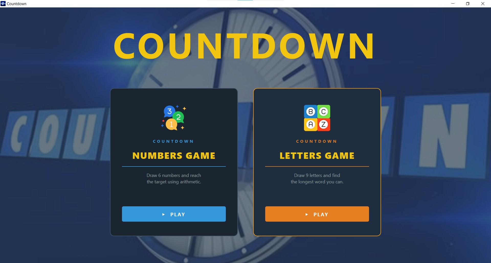
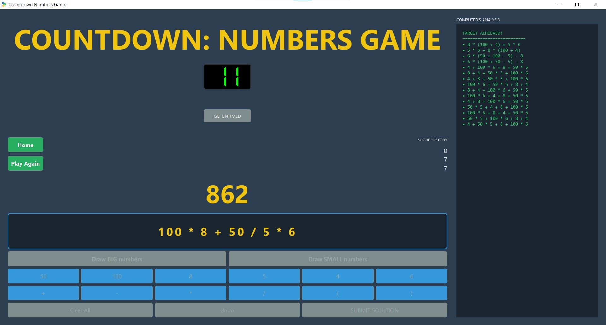
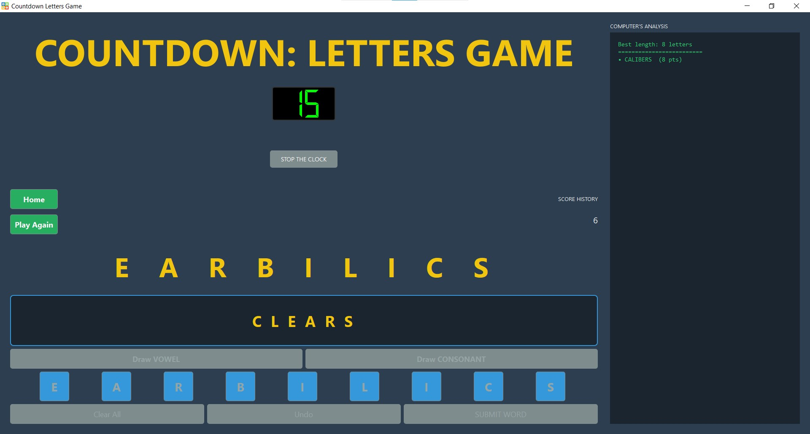

# 🎯 Countdown — Numbers & Letters Games

A faithful desktop recreation of the classic British TV game show **Countdown**, built with Python and PyQt5. Play the Numbers Game or the Letters Game from a polished launcher, complete with a 30-second countdown clock and an automatic computer solver that reveals the best possible answer after every round.

---

## 📸 Screenshots

| Home | Numbers Game | Letters Game |
|------|-------------|--------------|
|  |  |  |

---

## ✨ Features

### 🏠 Home Launcher (`main.py`)
- Full-screen animated home screen with background artwork
- Hover-animated game cards; each card launches its game in a separate process

### 🔢 Numbers Game (`numbersgame.py`)
- Draw up to 4 **Big** numbers (25, 50, 75, 100) and **Small** numbers (1–10 × 2)
- A random 3-digit target (100–999) is generated once 6 numbers are drawn
- Build an arithmetic expression using `+  −  ×  ÷  ( )` by clicking tiles
- Undo individual steps or clear the entire expression at any time
- **Scoring:** 10 pts for exact, 7 pts within 5, 5 pts within 10, 0 pts otherwise
- **Stop the Clock** button for untimed practice
- Running score history (last 7 rounds) displayed in-game
- Post-round **Computer's Analysis** panel enumerates all solutions (or the closest reachable value) using recursive combinatorial search

### 🔤 Letters Game (`lettersgame.py`)
- Draw up to 5 **Vowels** and 6 **Consonants** (frequency-weighted, authentic to the show)
- Build a word by clicking letter tiles; use **Undo** or **Clear All** to adjust
- 30-second countdown timer with optional **Stop the Clock**
- Word validated against a bundled dictionary (`words.txt`)
- **Scoring:** 18 pts for a 9-letter word, otherwise word length in points
- Post-round **Computer's Analysis** shows the longest possible word(s) from the drawn letters

---

## 🗂️ Project Structure

```
countdown/
├── main.py            # Home launcher
├── numbersgame.py     # Numbers Game
├── lettersgame.py     # Letters Game
├── words.txt          # English word list (one word per line)
├── images/
│   ├── icon.jpg       # Window / taskbar icon
│   ├── num.png        # Numbers Game card icon
│   └── let.png        # Letters Game card icon
├── requirements.txt
├── .gitignore
└── README.md
```

---

## 🚀 Getting Started

### Prerequisites

- Python 3.8 or higher
- pip

### Installation

```bash
# 1. Clone the repository
git clone https://github.com/your-username/countdown.git
cd countdown

# 2. (Recommended) Create and activate a virtual environment
python -m venv .venv
# Windows
.venv\Scripts\activate
# macOS / Linux
source .venv/bin/activate

# 3. Install dependencies
pip install -r requirements.txt
```

### Running the App

```bash
# Launch the home screen (recommended)
python main.py

# Or launch a game directly
python numbersgame.py
python lettersgame.py
```

---

## 🎮 How to Play

### Numbers Game
1. Click **Draw BIG numbers** or **Draw SMALL numbers** until you have 6 tiles.
2. A 3-digit target appears and the 30-second clock starts.
3. Click number tiles and operator buttons (`+`, `−`, `×`, `÷`, `(`, `)`) to build your expression.
4. Use **Undo** to remove the last token or **Clear All** to start over.
5. Click **SUBMIT SOLUTION** before time runs out.
6. The computer's analysis panel reveals all solutions after the round.

> **Rules (faithful to the show):** Each number may only be used once. Division must be exact (no fractions). Intermediate and final results must be positive integers.

### Letters Game
1. Click **Draw VOWEL** or **Draw CONSONANT** until you have 9 letter tiles.
   - Maximum 5 vowels and 6 consonants (the rest are drawn automatically).
2. The 30-second clock starts once all 9 letters are drawn.
3. Click letter tiles to spell your word; use **Undo** or **Clear All** to adjust.
4. Click **SUBMIT WORD** before time runs out.
5. The computer's analysis panel shows the longest valid word(s) available.

---

## 📦 Dependencies

| Package | Version | Purpose |
|---------|---------|---------|
| [PyQt5](https://pypi.org/project/PyQt5/) | ≥ 5.15.0 | GUI framework |

All other modules (`sys`, `random`, `ast`, `itertools`, `collections`) are part of the Python standard library.

---

## 🐛 Bug Fixes (vs. original)

| File | Issue | Fix |
|------|-------|-----|
| `main.py` | `QMessageBox.critical()` called with only 2 arguments — missing the message text, causing a `TypeError` crash when a game file is not found | Added descriptive third argument |
| `numbersgame.py` | `reset_game()` set the *Stop the Clock* button label to `"GO UNTIMED"` (leftover from an earlier version), causing inconsistent UI on replay | Corrected label back to `"STOP THE CLOCK"` |
| `numbersgame.py` | `reset_game()` did not call `self.countdown_timer.stop()` before resetting state, so a running timer could fire mid-reset | Added `self.countdown_timer.stop()` at the top of `reset_game()` |

---

## 🤝 Contributing

Pull requests are welcome. For major changes, please open an issue first to discuss what you'd like to change.

1. Fork the repository
2. Create a feature branch (`git checkout -b feature/my-feature`)
3. Commit your changes (`git commit -m 'Add my feature'`)
4. Push to the branch (`git push origin feature/my-feature`)
5. Open a Pull Request

---

## 📄 License

This project is licensed under the [MIT License](LICENSE).

> Countdown is a registered trademark of ITV Studios. This project is an independent fan recreation for educational and personal use and is not affiliated with or endorsed by ITV.
